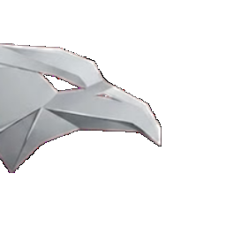

# MetalDaze Launcher

**Launcher oficial de MetalDaze Estudio para Minecraft Java Edition**

 

---

## 📸 Vista previa

<!-- PONER SCREENSHOT AQUÍ -->
<!-- Para agregar la screenshot: sube la imagen al repo y reemplaza esta línea por: -->
<!--  -->

> *Screenshot del menú principal próximamente*

---

## ¿Qué es MetalDaze Launcher?

MetalDaze Launcher es el launcher oficial de **MetalDaze Estudio**, diseñado para ofrecer una experiencia de juego simple, rápida y centralizada para los servidores y proyectos de la comunidad. Desde el launcher podés iniciar sesión con tu cuenta de Microsoft, elegir tu instancia de juego, ver las últimas noticias del servidor y configurar todo sin tocar ningún archivo manualmente.

El launcher está construido sobre **Electron** y utiliza un backend propio para gestionar instancias, noticias y archivos del juego, todo servido desde infraestructura en la nube para garantizar descargas rápidas y confiables.

---

## Características

- 🔐 **Login con Microsoft** — autenticación oficial con cuentas premium de Minecraft
- 🎮 **Múltiples instancias** — cambiá entre distintas versiones o modpacks desde el mismo launcher sin configuración adicional
- 📰 **Noticias del servidor** — mantenete al tanto de novedades y actualizaciones directamente desde el launcher
- ⚙️ **Panel de configuración completo** — ajustá RAM, resolución, Java, opciones del juego y más sin complicaciones
- 🎨 **Cambio de skins** — aplicá y gestioná tus skins de Minecraft directamente desde el launcher con historial local
- 🎵 **Discord Rich Presence** — muestra tu actividad en Discord mientras usás el launcher
- 🌑 **Diseño minimalista** — interfaz oscura limpia e inspirada en launchers modernos
- ☁️ **Mods desde la nube** — los archivos se sirven desde Cloudflare R2 para descargas rápidas y confiables

---

## Descarga

> La versión más reciente es la **v0.2.0** — es importante mantener el launcher actualizado.

| Archivo | Arquitectura | Tamaño |
|--------|-------------|--------|
| [MetalDaze-Launcher-win-x64.exe](https://github.com/GhanxocS/MetalDaze-Launcher/releases/latest/download/MetalDaze-Launcher-win-x64.exe) | Windows 64-bit | ~104 MB |
| [MetalDaze-Launcher-win-arm64.exe](https://github.com/GhanxocS/MetalDaze-Launcher/releases/latest/download/MetalDaze-Launcher-win-arm64.exe) | Windows ARM64 | ~106 MB |
| [MetalDaze-Launcher-win.exe](https://github.com/GhanxocS/MetalDaze-Launcher/releases/latest/download/MetalDaze-Launcher-win.exe) | Windows (universal) | ~209 MB |

También podés ver todas las versiones en la sección [Releases](https://github.com/GhanxocS/MetalDaze-Launcher/releases).

---

## Stack técnico

- **[Electron](https://www.electronjs.org/)** + Node.js — base del launcher de escritorio
- **[Express](https://expressjs.com/)** — backend propio para servir configuración, noticias e instancias
- **[minecraft-java-core](https://github.com/luuxis/minecraft-java-core)** — lanzamiento y gestión del juego
- **[Cloudflare R2](https://www.cloudflare.com/developer-platform/r2/)** — almacenamiento y distribución de archivos e instancias
- **[discord-rpc](https://www.npmjs.com/package/discord-rpc)** — integración con Discord Rich Presence

---

## Créditos

Este proyecto está basado en **[Selvana Launcher](https://github.com/luuxis/Selvania-Launcher)** de **[Luuxis](https://github.com/luuxis)**.

Gracias a Luuxis por construir una base sólida, bien estructurada y de código abierto que hizo posible este proyecto. Su trabajo en Selvana Launcher y en `minecraft-java-core` es la columna vertebral sobre la que se desarrolló MetalDaze Launcher.

| | |
|---|---|
| 📦 Repositorio original | [Selvana Launcher](https://github.com/luuxis/Selvania-Launcher) |
| 👤 GitHub de Luuxis | [github.com/luuxis](https://github.com/luuxis) |
| 📄 Licencia | [Luuxis License v1.0](./LICENSE.md) |

---

Desarrollado con dedicación por **MetalDaze Estudio**

